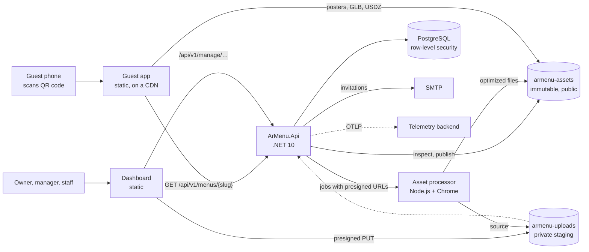
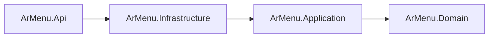
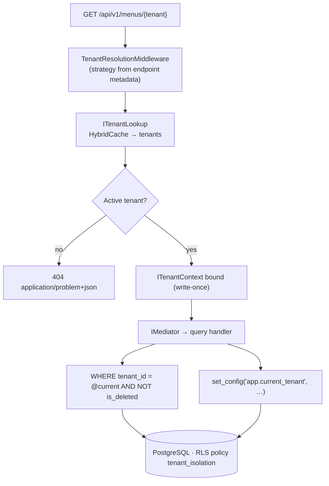

# ArMenu

Multi-tenant B2B SaaS for QR-code restaurant menus with WebAR. Guests scan a code at the table, read the menu in their
own language and place a dish on the table in augmented reality (Google `<model-viewer>`), with no app to install.

> **Status:** Complete through Phase 12, the last one: alerts, a runbook and an end-to-end run of the production
> images. See the [roadmap](#roadmap).

## Tech stack

| Area | Choice |
| --- | --- |
| Runtime | .NET 10 (LTS), C# 14 |
| API | ASP.NET Core minimal APIs, RFC 9457 problem details, OpenAPI 3.1 with a Scalar reference UI |
| Application | CQRS with source-generated [Mediator](https://github.com/martinothamar/Mediator) (MIT), FluentValidation, Result pattern |
| Security | JWT access tokens scoped to one tenant, rotating refresh tokens in HttpOnly cookies, PBKDF2-SHA512, rate limiting |
| Persistence | EF Core 10, PostgreSQL 18 (Npgsql), row-level security |
| Caching | HybridCache with tag-based invalidation |
| Web | React 19 with React Compiler, TypeScript 6, Vite 8, TanStack Router and Query, Tailwind CSS 4, pnpm workspace |
| Dashboard UI | React Aria Components (accessible dialogs, menus and keyboard drag and drop), `uqr` for QR codes |
| Storage | S3-compatible object storage (SeaweedFS locally) with presigned uploads, AWS SDK for .NET |
| WebAR | `<model-viewer>` 4 (three.js), loaded on demand; Meshopt + WebP models, a Scene Viewer GLB, USDZ and posters |
| Asset pipeline | Node.js service: glTF Transform, meshoptimizer, sharp, `<model-viewer>` in headless Chrome (Playwright) |
| E-mail | MailKit over SMTP; Mailpit locally |
| Observability | OpenTelemetry traces, metrics and logs over OTLP; Aspire Dashboard locally |
| Delivery | Chiseled .NET images, EF Core migration bundles, nginx for the web apps, GitHub Actions, Dependabot |
| API contract | Committed OpenAPI document; TypeScript types via openapi-typescript, requests via openapi-fetch |
| Quality | .NET analyzers with warnings as errors, Central Package Management; ESLint (type-checked), Prettier, pnpm catalogs |
| Testing | xUnit v3, Shouldly, Testcontainers, NetArchTest; Vitest, Playwright, axe-core |

## Architecture



The API follows Clean Architecture: source dependencies only point inwards, and architecture tests fail the build if
that changes.



| Path | Responsibility |
| --- | --- |
| `src/ArMenu.Domain` | Aggregates (`Tenant`, `MenuCategory`, `MenuItem`, `User`, `TenantMembership`, `UserSession`), value objects, repository contracts, `Result`/`Error`. No dependencies. |
| `src/ArMenu.Application` | Commands, their validators and handlers (writes through aggregates); query contracts; pipeline behaviors; security abstractions. |
| `src/ArMenu.Infrastructure` | EF Core mapping, repositories, **query handlers** (read-model projections), isolation and cache interceptors, JWT, password hashing, row-level security migrations. |
| `src/ArMenu.Api` | Composition root, endpoints, tenant resolution, authentication, authorization, rate limiting, error handling, OpenAPI. |
| `contracts/openapi` | The API contract the web apps generate their types from ([ADR-0008](docs/adr/0008-openapi-contract.md)). |
| `web/apps/guest` | The guest menu opened from QR codes. |
| `web/apps/dashboard` | The management dashboard: menu editor, 3D models, QR codes, languages. |
| `web/packages/api-client` | Generated API types and the typed HTTP client. |
| `web/packages/ar-viewer` | `<model-viewer>` for React with the shared camera and lighting preset. |
| `web/tools/demo-assets` | Generates the demo dishes: GLB, USDZ and posters. |
| `web/packages/model-pipeline` | Turns a GLB into the web model, the Scene Viewer model, the USDZ and the poster, with a report. |
| `web/services/asset-processor` | The pipeline as an internal HTTP service ([ADR-0011](docs/adr/0011-3d-asset-pipeline.md)). |
| `contracts/asset-processor` | Example job, result and rejection documents that the API's and the processor's tests both check. |
| `web/packages/locale` | Language names, text direction and price formatting shared by both apps. |
| `web/packages/web-security` | The web apps' security headers (content security policy included), for `vite preview` and nginx. |
| `web/apps/Dockerfile` · `web/apps/nginx` | Container images of the web apps. |
| `src/ArMenu.Api/Dockerfile` | API and migration bundle images. |
| `.github/` | CI workflow and Dependabot. |
| `assets/demo` | The generated demo dishes, copied into local storage when the API starts in Development. |
| `deploy/` | PostgreSQL bootstrap script, storage identities and CORS rules, `compose.production.yml` (the whole platform from its images) and the alert rules with their tests. |
| `docs/operations` | The [runbook](docs/operations/runbook.md): releasing, secrets, backups, and what to do for each alert. |

A request flows `endpoint → IMediator → TelemetryBehavior → LoggingBehavior → ValidationBehavior → handler`. Expected failures are results,
translated into problem details. Exceptions are reserved for bugs and infrastructure faults. See
[ADR-0005](docs/adr/0005-cqrs-with-source-generated-mediator.md).

## Guest web app

A static React app: menus at `/m/{slug}`, in the language the guest picks, with dishes to turn in 3D and place on the
table. See [ADR-0007](docs/adr/0007-guest-web-app.md).

- **Fast first load.** A 4 KB entry chunk starts the menu request while the app code downloads in parallel. The build
  fails if startup JavaScript exceeds 130 KiB gzip (117 KiB today).
- **WebAR on demand.** The 3D stack (290 KB gzip) loads only when a guest opens a dish with a model. The build fails if
  it leaks into startup chunks. Posters show instantly and are rendered with the viewer's own preset, so the model
  takes over without a jump. Android Scene Viewer, iOS Quick Look and WebXR show the dish at its real size.
- **The URL is the state.** `?lang=`, `?item=` and `?table=`: the back button closes a dish, links can open one, and
  table QR codes show the table number.
- **Anonymous counts only.** The menu reports views, opened dishes, loaded models and AR starts as daily counters:
  no cookie, no identifier, no storage.
- **For every guest.** Turkish, English, German, Russian and Arabic interface (right to left included), dark mode,
  Save-Data support, WCAG 2.2 AA checks in end-to-end tests, and no third-party requests.

### Measured performance

Production build against the local API and a local static asset server, Lighthouse 13 mobile profile, median of three runs.

| Metric | Result |
| --- | --- |
| Lighthouse scores (simulated throttling) | Performance 98, Accessibility 100, Best Practices 100, SEO 100 |
| Total Blocking Time · Cumulative Layout Shift | 0 ms · 0 |
| LCP under DevTools throttling (150 ms RTT, 1.6 Mbps, 4× CPU) | 2,044 ms, versus 2,613 ms without the early menu request |
| Startup JavaScript · 3D chunk (gzip) | 117 KiB · 291 KiB, on demand |
| Demo burger transfer (gzip): web GLB · Scene Viewer GLB · USDZ · poster | 31 KiB · 74 KiB · 82 KiB · 36 KiB |

## Management dashboard

A static React app at `/{workspace}` for the people running the restaurant. See
[ADR-0010](docs/adr/0010-management-dashboard.md).

- **Sessions without a stored token.** The access token lives only in memory; a reload restores it through the
  HttpOnly refresh cookie. Refreshes are single-flight and serialized across tabs with the Web Locks API.
- **Roles in the interface.** Owners and managers edit; staff see the same menu with only the sold-out switches.
- **Menu editor.** Categories and dishes with every offered language, drag-and-drop ordering (keyboard and screen
  reader included) with optimistic updates, and API validation shown on the field it concerns, in Turkish or English.
- **3D models.** One GLB goes straight from the browser to object storage with a signed type and size, and is processed
  in the background: the dish keeps its current model until the new one is live, and the dashboard shows the result
  (download size before and after, triangles, size on the table, warnings). The generated USDZ and poster can be
  replaced. See [ADR-0009](docs/adr/0009-direct-to-storage-asset-uploads.md) and
  [ADR-0011](docs/adr/0011-3d-asset-pipeline.md).
- **QR codes.** For the menu or per table (`?table=`), in a chosen language, as SVG, PNG or printable table cards.
  Encoded in the browser, with no tracking redirect.
- **Spreadsheets.** The whole menu exports as CSV and imports back with a preview: prices and translations change in
  bulk, all or nothing, and missing dishes are never deleted ([ADR-0021](docs/adr/0021-menu-spreadsheet-import.md)).
- **Allergens and diets.** Each dish declares the EU's fourteen allergens and whether it is vegetarian, vegan or
  gluten-free; "not declared" never reads as "none", and a diet cannot contradict the allergens. Guests search the menu
  and filter by diet or allergens to avoid, in the browser ([ADR-0023](docs/adr/0023-allergens-and-guest-filters.md)).
- **Appearance.** The business's name, its logo and one colour, shown at the top of the guest menu. The colour only
  fills shapes and the API says what text stays legible on it, so a menu can never be painted unreadable
  ([ADR-0022](docs/adr/0022-business-appearance.md)).
- **Settings.** Which languages the menu offers, which one is the default, and the business's time zone.
- **Statistics.** Menu views, opened dishes, 3D views and AR starts per day, and the dishes guests open most with their
  AR rate. Counted without anything that identifies a guest ([ADR-0016](docs/adr/0016-privacy-preserving-guest-analytics.md)).
- **Account.** Password reset by e-mail, address verification with a reminder until it is done, and the other
  businesses of the person one click away, and deleting the account for good, which closes only businesses nobody else
  works in ([ADR-0017](docs/adr/0017-ownership-transfer-and-account-deletion.md), [ADR-0014](docs/adr/0014-account-recovery-and-email-verification.md),
  [ADR-0015](docs/adr/0015-workspace-switching.md)).
- **History.** Who changed which dish, price, category, setting or team member, and when, with before and after
  values ([ADR-0018](docs/adr/0018-business-history.md)).
- **Team.** The owner invites managers and staff by e-mail, sends invitations again or withdraws them, changes roles,
  removes members and hands the business over, confirmed with the password. The invitation link opens a join page that creates the account, or confirms an existing one,
  and signs the person in. See [ADR-0013](docs/adr/0013-team-invitations.md).
- **Sign-up.** A new business picks its address, creates the owner account and lands in its empty menu.

## 3D asset pipeline

A business uploads the GLB its 3D tool or scanner produced; every guest device gets the file it decodes fastest. See
[ADR-0011](docs/adr/0011-3d-asset-pipeline.md).

| File | For | Made of |
| --- | --- | --- |
| Web model | In-page viewer, WebXR | Meshopt geometry, WebP textures ≤ 2048 px |
| Scene Viewer model | Android browsers without WebXR | Plain glTF, JPEG/PNG textures ≤ 2048 px |
| USDZ | iPhone and iPad AR | Exported by `<model-viewer>` from the web model |
| Poster | Instant first paint | The web model's first frame in `<model-viewer>` |

- **Optimized, not just converted.** Draco and Meshopt sources are decoded; meshes are simplified to 100,000
  triangles and textures resized to 2048 px when larger. A 47 MB scan with a 4K texture became a 2.5 MB web model.
- **Verified where it counts.** The poster and USDZ come from the web model loaded in the viewer guests use, so a model
  that cannot render is rejected with a reason instead of published. The API inspects every output before attaching it.
- **Reliable jobs.** A PostgreSQL queue with leases and `SKIP LOCKED`, retries for outages, final answers for broken
  files, and the newest upload winning over older ones. The processor only ever sees presigned URLs.
- **No leftovers.** An hourly cleanup deletes abandoned uploads and files no dish uses anymore.

| Measured locally, processor container on an arm64 Mac | Result |
| --- | --- |
| Source: Draco GLB, 262,144 triangles, 4096 px texture | 47.0 MB |
| Web model · Scene Viewer model · USDZ · poster | 2.5 MB · 3.6 MB · 10.2 MB · 34 KB |
| Processing time | 7.6 s |

## Multi-tenancy: defense in depth

All tenants share one database and schema, and every tenant-owned row carries a `tenant_id`. Isolation never depends on
a single mechanism:

| Layer | Mechanism | Stops |
| --- | --- | --- |
| 1. Resolution | Each endpoint declares where its tenant comes from: `RequireTenantFromRoute()` (public menu, sign-in, slug) or `RequireTenantFromClaims()` (staff, signed token). There is no global fallback chain and no header-based selection. | Tenant spoofing via a client-chosen source |
| 2. Reads | Named EF Core query filter `Tenant`. Querying without a bound tenant throws `TenantNotResolvedException` instead of returning rows. | Reading another tenant's data |
| 3. Writes | SaveChanges interceptor verifies the owner of every added, modified or deleted row, including manually attached entities. | Writing to another tenant's data |
| 4. Keys | Tenant-leading composite keys `(tenant_id, id)` and composite foreign keys such as `(tenant_id, category_id)`. | Cross-tenant references, even with buggy application code |
| 5. Database | PostgreSQL row-level security (`FORCE`d) keyed on `app.current_tenant`, which is set on every connection open. The runtime role has no `BYPASSRLS`. | Raw SQL, `IgnoreQueryFilters()`, forgotten filters |



Guardrail tests fail the build when a table with a `tenant_id` column has no enforced policy, or when a tenant-scoped
entity has no tenant query filter. See [ADR-0003](docs/adr/0003-multi-tenancy-defense-in-depth.md).

## Authentication

Staff sign in to a **workspace**: `POST /api/v1/tenants/{tenant}/auth/sign-in`. Credentials are only checked against
that tenant's memberships, so login never needs to read across tenants.

- **Access token:** a 15-minute JWT (HS256, algorithm pinned) carrying `sub`, `tenant_id`, `role` and `sid`.
- **Refresh token:** an opaque 256-bit secret in an `HttpOnly; Secure; SameSite=Strict` cookie whose path is limited to
  the workspace's auth endpoints. Only its SHA-256 hash is stored.
- **Rotation with reuse detection:** every refresh replaces the token. Replaying a replaced token revokes the whole
  session. A 30-second grace period keeps two tabs refreshing at once from logging each other out.
- **Hardening:**
  - Passwords are hashed with PBKDF2-SHA512 at 210,000 iterations and upgraded on sign-in.
  - Five consecutive failures lock the account for 15 minutes.
  - Unknown accounts, wrong passwords and lockouts return identical answers with equal hashing work.
  - Authentication endpoints are rate limited.
  - A fallback policy requires authentication on every endpoint that is not explicitly anonymous.

- **Recovery and verification:** single-use e-mailed links (1 hour for a password reset, 3 days for verification),
  hashed at rest. Reset requests answer the same whether or not an account exists, and the e-mail is sent in the
  background. A reset ends every earlier session in every business; inviting a team requires a verified address.

Roles are per tenant. Owner and Manager can edit the menu; Staff can mark items as sold out; only the Owner manages the
team. People join a business through e-mail invitations whose secret works like a refresh token: hashed at rest, in the
URL fragment and request bodies only ([ADR-0013](docs/adr/0013-team-invitations.md)).
See [ADR-0006](docs/adr/0006-authentication-and-sessions.md).

## API

| Method and path | Access | Purpose |
| --- | --- | --- |
| `POST /api/v1/tenants` | Anonymous, rate limited | Sign up: creates the business and its owner, signs the owner in |
| `POST /api/v1/tenants/{tenant}/auth/sign-in` | Anonymous, rate limited | Access token (with `expiresIn`) in the body, refresh token cookie |
| `POST /api/v1/tenants/{tenant}/auth/refresh` | Refresh cookie | Rotates the session |
| `POST /api/v1/tenants/{tenant}/auth/sign-out` | Refresh cookie | Revokes the session and clears the cookie |
| `GET /api/v1/me` | Any member | Current user and tenant |
| `GET /api/v1/menus/{tenant}?lang=` | Anonymous, rate limited | Guest menu in the best language (`lang`, then `Accept-Language`), cached |
| `GET /api/v1/manage/menu` | Any member | Full menu with every translation, including hidden entries |
| `GET /api/v1/manage/menu/export` · `POST …/import?dryRun=` | Owner, Manager | The menu as CSV; apply a CSV, or preview what it would change |
| `PUT /api/v1/manage/menu/items/{id}/availability` | Any member | Sold out / available again |
| `POST · PUT · DELETE /api/v1/manage/menu/categories[/{id}]` | Owner, Manager | Category management |
| `POST · PUT · DELETE /api/v1/manage/menu/items[/{id}]` | Owner, Manager | Item management |
| `PUT · DELETE /api/v1/manage/menu/items/{id}/ar-model` | Owner, Manager | Attach or detach a model's files (replacing the generated USDZ or poster) |
| `POST /api/v1/manage/menu/items/{id}/ar-model/processing` | Owner, Manager | Process an uploaded GLB into the item's model (202, runs in the background) |
| `GET /api/v1/manage/menu/items/{id}/ar-model/processing` | Owner, Manager | Progress of the latest processing, or its report |
| `PUT /api/v1/manage/menu/categories/order`, `…/categories/{id}/items/order` | Owner, Manager | Drag-and-drop ordering |
| `POST /api/v1/manage/assets/uploads` | Owner, Manager | Presigned upload for a GLB, USDZ, poster or logo of a declared type and size |
| `POST /api/v1/manage/assets/uploads/{id}/publish` | Owner, Manager | Inspects an uploaded USDZ, poster or logo and publishes it under an immutable key |
| `PUT /api/v1/manage/settings/languages` | Owner, Manager | Offered languages and the default |
| `POST /api/v1/auth/password-reset` · `…/password-reset/confirm` | Anonymous, rate limited | E-mail a reset link (always 202); set a new password with it |
| `POST /api/v1/auth/email-verification/confirm` · `POST /api/v1/me/email-verification` | Link secret · signed in | Confirm the address; send a new link |
| `GET /api/v1/me/workspaces` | Signed in | The businesses of the person, with their role in each |
| `POST /api/v1/menus/{tenant}/events` | Anonymous, rate limited | Count guest events (no identifiers) |
| `GET /api/v1/manage/statistics?days=` | Owner, Manager | Daily guest activity and top dishes, up to 90 days |
| `GET /api/v1/manage/history?before=&limit=` | Owner, Manager | Who changed what, newest first, paged |
| `PUT /api/v1/manage/settings/time-zone` | Owner, Manager | The business's IANA time zone |
| `PUT /api/v1/manage/settings/branding` | Owner, Manager | The business's name, logo and colour |
| `POST /api/v1/manage/team/members/{id}/ownership` | Owner | Hands the business over, with the owner's password |
| `GET` / `POST /api/v1/me/deletion` | Signed in | What deleting the account would do; deleting it, with the password |
| `GET /api/v1/manage/team` | Owner | Members and pending invitations |
| `POST /api/v1/manage/team/invitations` · `…/{id}/resend` · `DELETE …/{id}` | Owner | Invite by e-mail, send again with a new link, withdraw |
| `PUT /api/v1/manage/team/members/{id}/role` · `DELETE …/members/{id}` | Owner | Change between manager and staff, remove (sessions end) |
| `POST /api/v1/tenants/{tenant}/invitations/lookup` | Invitation secret, rate limited | What the invitation offers |
| `POST /api/v1/tenants/{tenant}/invitations/accept` | Invitation secret, rate limited | Join (new account, or existing account's password) and sign in |

The full contract is [`contracts/openapi/v1.json`](contracts/openapi/v1.json). In Development the interactive API
reference is at `http://localhost:5080/scalar`.

## Getting started

Prerequisites: [.NET 10 SDK](https://dotnet.microsoft.com/download/dotnet/10.0), Docker, Node.js 24 or later,
[pnpm](https://pnpm.io/installation) 12, and Google Chrome for end-to-end tests and poster rendering.

Start PostgreSQL, the local object storage (SeaweedFS, S3 API on port 8333) and Mailpit, which catches the e-mails the
API sends (read them at `http://localhost:8025`):

```bash
docker compose up -d
```

Start the API:

```bash
dotnet run --project src/ArMenu.Api
```

Install the web dependencies:

```bash
pnpm --dir web install
```

Start the guest app and open `http://localhost:5173/m/kadikoy-burger-lab` (or `bogazici-balikcisi`):

```bash
pnpm --dir web dev
```

Start the dashboard and open `http://localhost:5174`:

```bash
pnpm --dir web --filter @armenu/dashboard dev
```

Start the asset processor, which uses your installed Google Chrome, to process uploaded models:

```bash
pnpm --dir web --filter @armenu/asset-processor dev
```

Or run it in a container (then start the API with `Storage__InternalServiceUrl=http://host.docker.internal:8333`, so
the URLs it signs for the processor use an address the container can reach):

```bash
docker compose --profile processor up -d asset-processor
```

To try AR on a real phone, the app, the API and storage must be reachable from it: use your computer's network address
in `web/apps/guest/.env.development`, `Assets:PublicBaseUrl`, `Storage:ServiceUrl` and `Cors:AllowedOrigins`, and start
Vite with `--host`.

In `Development` the API applies migrations, seeds two demo businesses with staff accounts, and creates the storage
buckets with the demo dishes. Every demo account uses the password `ArMenu-Demo-2026`.

| Workspace | Account | Role |
| --- | --- | --- |
| `kadikoy-burger-lab` | `owner@kadikoy-burger-lab.test` | Owner |
| `kadikoy-burger-lab` | `staff@kadikoy-burger-lab.test` | Staff |
| `bogazici-balikcisi` | `owner@bogazici-balikcisi.test` | Owner |

```bash
curl "http://localhost:5080/api/v1/menus/bogazici-balikcisi?lang=de"
```

```bash
curl -i -H "Content-Type: application/json" -d '{"email":"owner@kadikoy-burger-lab.test","password":"ArMenu-Demo-2026"}' http://localhost:5080/api/v1/tenants/kadikoy-burger-lab/auth/sign-in
```

Health probes: `/health/live` and `/health/ready` (database connectivity).

To see traces, metrics and logs, start the Aspire Dashboard (`http://localhost:18888`) and run the API with
`OTEL_EXPORTER_OTLP_ENDPOINT=http://localhost:4317`:

```bash
docker compose --profile observability up -d aspire-dashboard
```

### Running the production images

`deploy/compose.production.yml` builds the five images CI publishes and runs them together: the API in the
`Production` environment, migrations applied by the bundle, storage provisioned by a separate step, telemetry in the
Aspire Dashboard. Guest menus are at `http://localhost:8081/m/{slug}`, the dashboard at `http://localhost:8082`, e-mail
at `http://localhost:18025` and telemetry at `http://localhost:18888`. The database starts empty: sign up a business.
See [ADR-0012](docs/adr/0012-production-delivery-and-operations.md).

```bash
docker compose -f deploy/compose.production.yml up --build --detach
```

### Operations

[`docs/operations/runbook.md`](docs/operations/runbook.md) covers releasing (migrations first, then the API, then the
static apps), rotating each secret, backups and the deletion promise, and one section per alert with the queries to run.
The alerts themselves are [`deploy/observability/alert-rules.yml`](deploy/observability/alert-rules.yml) in Prometheus'
rule format; they watch what is waiting in the workers' queues rather than error rates alone
([ADR-0024](docs/adr/0024-alerting-on-backlogs.md)). CI checks them and plays series through them:

```bash
docker run --rm --entrypoint promtool -v "$PWD/deploy/observability:/rules:ro" -w /rules prom/prometheus:v3.7.3 test rules alert-rules.test.yml
```

### Configuration

| Setting | Notes |
| --- | --- |
| `ConnectionStrings:ArMenu` | Runtime role, subject to row-level security. `No Reset On Close` is refused at startup. |
| `ConnectionStrings:ArMenuMigrations` | Schema owner, migrations only. |
| `Authentication:Jwt:SigningKey` | Base64 key of at least 256 bits. Required outside Development; the app refuses to start without it. |
| `Assets:PublicBaseUrl` | Public base URL of the assets bucket or its CDN. Required. Development: `http://localhost:8333/armenu-assets/`. |
| `Storage:*` | S3 endpoint the API calls, region, credentials, bucket names and presigned URL lifetime. `Storage:PublicServiceUrl` is the endpoint browsers upload to and `Storage:InternalServiceUrl` the one the processor uses, when they differ. |
| `AssetProcessor:*` | Processor URL and shared token (required while workers are enabled), timeout, workers, poll interval and lease. |
| `ArModelProcessing:*` · `AssetCleanup:*` | Retry delay and URL lifetime for jobs; cleanup interval and grace period. |
| `Retention:*` | How long a closed business's data is kept (30 days) and how often purges run. |
| `BacklogMetrics:*` | Whether the backlog gauges are sampled and how often (30 s). See [ADR-0024](docs/adr/0024-alerting-on-backlogs.md). |
| `ASSET_PROCESSOR_*` | Processor service: port, token, allowed storage origins, concurrency, source size limit, browser channel. |
| `Cors:AllowedOrigins` | Dashboard and guest app origins. Credentials are allowed for the refresh cookie. |
| `ReverseProxy:*` | Proxies whose `X-Forwarded-For`/`-Proto` are trusted (`KnownProxies`, `KnownNetworks` in CIDR) and how many (`ForwardLimit`). Rate limits depend on it. |
| `Email:*` | SMTP host, port, TLS mode (`StartTls` by default), credentials and sender. Required. Development: Mailpit on port 1025. `OutboxWorkerEnabled`, `OutboxPollInterval` and `OutboxLease` tune background delivery. |
| `Dashboard:Url` | Dashboard root that links in e-mails (invitations, password resets, verification) open. Required. |
| `OTEL_*` | OpenTelemetry: `OTEL_EXPORTER_OTLP_ENDPOINT` turns export on; `OTEL_SERVICE_NAME`, `OTEL_RESOURCE_ATTRIBUTES` as usual. |
| `RateLimiting:*` | Per-client limits for authentication, sign-up and public menus. |
| `VITE_API_BASE_URL` · `VITE_ASSETS_ORIGIN` | Guest app build settings, per mode in `web/apps/guest/.env.*`. |
| `VITE_API_BASE_URL` · `VITE_GUEST_MENU_BASE_URL` · `VITE_STORAGE_ORIGINS` | Dashboard build settings, per mode in `web/apps/dashboard/.env.*`. The second is the address QR codes point to; the third lists the storage origins the content security policy allows. |

### Tests

Integration tests start disposable PostgreSQL 18, SeaweedFS and (for e-mail delivery) Mailpit containers, so Docker must
be running. The asset
processor is replaced by a fake that uploads real pipeline outputs through the presigned URLs.

```bash
dotnet test --solution ArMenu.slnx
```

Formatting, linting, type checks, unit tests and production builds of the web workspace (the model pipeline's and the
processor's tests render in Google Chrome):

```bash
pnpm --dir web verify
```

End-to-end and accessibility tests of both apps against their production builds, with the API replaced by typed
in-memory fakes (guest: phone and desktop profiles; dashboard: desktop). Pages are served with the production security
headers, and any content security policy violation fails the test:

```bash
pnpm --dir web e2e
```

### API contract

When an API change alters the contract, `OpenApiContractTests` fails and rewrites
[`contracts/openapi/v1.json`](contracts/openapi/v1.json). Review the diff, regenerate the TypeScript types and commit
both:

```bash
pnpm --dir web generate:api
```

### Demo 3D assets

The demo dishes are modeled in code at real-world size and go through the same asset pipeline as a business's upload,
which writes the web model, the Scene Viewer model, the USDZ and the poster:

```bash
pnpm --dir web generate:demo-assets
```

### Database migrations

```bash
dotnet tool restore
```

```bash
dotnet ef migrations add <Name> --project src/ArMenu.Infrastructure --startup-project src/ArMenu.Infrastructure --output-dir Persistence/Migrations
```

Migrations run as the schema owner. The API connects as `armenu_app`, a role that row-level security applies to
([bootstrap script](deploy/postgres/init/01-create-app-role.sql)). New tenant-scoped tables must enable row-level
security in the migration that creates them; the guardrail test enforces it.

## Architecture decisions

| ADR | Decision |
| --- | --- |
| [0001](docs/adr/0001-dotnet-10-lts.md) | Target .NET 10 LTS |
| [0002](docs/adr/0002-postgresql.md) | PostgreSQL instead of MySQL |
| [0003](docs/adr/0003-multi-tenancy-defense-in-depth.md) | Shared-schema multi-tenancy with defense in depth |
| [0004](docs/adr/0004-domain-model.md) | Domain model: aggregates, value objects, identifiers, errors |
| [0005](docs/adr/0005-cqrs-with-source-generated-mediator.md) | CQRS with source-generated Mediator: writes through aggregates, reads as projections |
| [0006](docs/adr/0006-authentication-and-sessions.md) | Workspace sign-in, tenant-scoped JWTs, rotating refresh tokens |
| [0007](docs/adr/0007-guest-web-app.md) | Guest web app: a static React app with WebAR on demand |
| [0008](docs/adr/0008-openapi-contract.md) | The OpenAPI document is the contract between the API and the web apps |
| [0009](docs/adr/0009-direct-to-storage-asset-uploads.md) | 3D assets are uploaded straight to object storage and published after inspection |
| [0010](docs/adr/0010-management-dashboard.md) | Management dashboard: in-memory sessions, React Aria, server validation on fields |
| [0011](docs/adr/0011-3d-asset-pipeline.md) | One uploaded GLB is processed into every file guests' devices need |
| [0012](docs/adr/0012-production-delivery-and-operations.md) | Production delivery: container images, migration bundles, one security policy, OpenTelemetry |
| [0013](docs/adr/0013-team-invitations.md) | Team members join by e-mail invitation |
| [0014](docs/adr/0014-account-recovery-and-email-verification.md) | Password reset and e-mail verification through single-use links |
| [0015](docs/adr/0015-workspace-switching.md) | A person lists their own businesses through one narrow row-level security policy |
| [0016](docs/adr/0016-privacy-preserving-guest-analytics.md) | Guest analytics are daily counters, with nothing about the guest |
| [0017](docs/adr/0017-ownership-transfer-and-account-deletion.md) | Ownership is handed over; deleting an account erases the person, not the businesses |
| [0018](docs/adr/0018-business-history.md) | A business's history is written by the save pipeline and names people only by account |
| [0019](docs/adr/0019-durable-email-outbox.md) | Background e-mail goes through a database outbox |
| [0020](docs/adr/0020-closed-business-retention.md) | A closed business's data is kept for 30 days, then deleted |
| [0021](docs/adr/0021-menu-spreadsheet-import.md) | Menus are edited in bulk as a CSV spreadsheet, previewed and applied all or nothing |
| [0022](docs/adr/0022-business-appearance.md) | A business's colour fills shapes on its menu; the API decides the text drawn on it |
| [0023](docs/adr/0023-allergens-and-guest-filters.md) | Allergens distinguish "none" from "not declared"; guests filter the menu on their own phone |
| [0024](docs/adr/0024-alerting-on-backlogs.md) | Alerts watch what is waiting, and every alert has a runbook section |

## Roadmap

1. **Core domain and multi-tenancy** (done)
2. **Application layer and API:** CQRS, validation, error handling, authentication (done)
3. **Guest web app:** React, `<model-viewer>` loaded on demand, generated demo dishes, measured performance (done)
4. **Management dashboard:** menu editor, direct-to-storage 3D uploads with inspection, QR codes, languages (done)
5. **3D asset pipeline:** processing service, Meshopt/WebP web models, Scene Viewer models, USDZ and posters from one
   GLB, job queue, cleanup (done)
6. **Production readiness:** container images and migration bundles, trusted proxies, content security policy tested
   end to end, OpenTelemetry, CI; team invitations by e-mail (done)
7. **Accounts and insight:** password reset, e-mail verification, workspace switching, privacy-preserving guest
   analytics with a statistics page (done)
8. **Ownership and accountability:** ownership transfer, account deletion with erasure, business time zones, a
   history of changes (done)
9. **Durability and bulk editing:** a database outbox for e-mail, purging closed businesses after 30 days, menu
   export and import as CSV with a preview (done)
10. **A business's own face:** its name, logo and colour on the guest menu, with legibility decided by the API (done)
11. **Allergens and search:** the EU's fourteen allergens and three diets per dish, kept apart from "not declared";
    guests search and filter on their own phone (done)
12. **Operations and release (last):** backlog metrics with tested alert rules, a runbook, and an end-to-end run of the
    production images (done)
