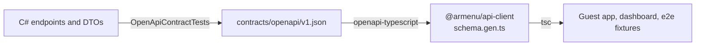

# ADR-0008: The OpenAPI document is the contract between the API and the web apps

- **Status:** Accepted
- **Date:** 2026-09-14

## Context

The API is written in C#, the web apps in TypeScript. Hand-written TypeScript types drift silently from the API, and
validating every response at runtime costs bundle size on the guest app, where every kilobyte delays the menu.

Treating the generated OpenAPI document as a contract immediately exposed three defects that would have produced wrong
client types:

- **Invisible route parameter:** the `{tenant}` slug is resolved by middleware, not bound to a handler argument, so API
  Explorer did not list it.
- **Loose numbers:** the web JSON defaults also read numbers from strings, so every number, including prices, was
  typed as "number or string".
- **Undocumented error members:** problem details carried `code`, `traceId` and `errorCodes`, but the schema did not
  say so.

## Decision

### A committed contract, verified on both sides

- `contracts/openapi/v1.json` is generated from the running API through `IOpenApiDocumentProvider`, in
  `OpenApiContractTests`, without HTTP or server URLs, so it is stable. The test fails when the API no longer matches
  the committed file. Locally it also rewrites the file, so the change can be reviewed as a diff; on CI it only fails.
- `@armenu/api-client` generates TypeScript types from that file with openapi-typescript, and a Vitest test fails when
  the generated types are stale.
- Requests use openapi-fetch: paths, parameters and response bodies are checked by the compiler, for a few kilobytes
  of runtime code. Failed responses become an `ApiError` carrying the problem details.

The workflow for an API change: run the .NET tests (the contract is rewritten and the test fails), review the diff,
run `pnpm --dir web generate:api`, and commit both.

### Contract fixes in the API

| Defect | Fix |
| --- | --- |
| Invisible tenant slug | `TenantRouteParameterTransformer` documents the route parameter on every endpoint that resolves its tenant from the route. |
| "number or string" | Strict JSON number handling. The API now rejects `"45"` where a number is expected, as the contract says. |
| Undocumented error members | `ProblemDetailsSchemaTransformer` documents `code`, `traceId` and, for validation problems, `errorCodes`. |
| Undocumented 429 | `WithRateLimit` applies a rate limiting policy and documents its problem response in one call. |

## Consequences

- An API change that breaks a client is a TypeScript compile error in the same change, not a production bug.
- End-to-end fixtures are typed by the contract, so stubbed responses cannot drift from real ones.
- Generated code is committed: reviewable, and the web build does not need the API.
- Rejected: generating the document at build time with `Microsoft.Extensions.ApiDescription.Server`, which starts the
  application during every build and needs production configuration to do so; runtime schemas (such as Zod), which
  duplicate the types and add bundle size; class-based client generators, which are heavier than a typed `fetch`.
