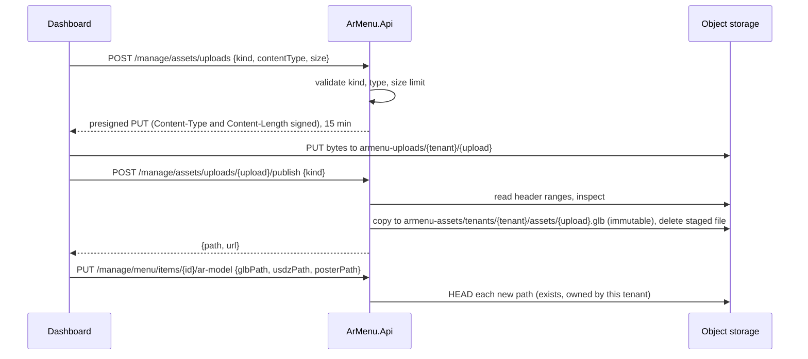

# ADR-0009: 3D assets are uploaded straight to object storage and published after inspection

- **Status:** Accepted; amended by [ADR-0011](0011-3d-asset-pipeline.md): GLB uploads are processed, not published as uploaded
- **Date:** 2026-09-14

## Context

A dish in AR needs up to three files: a GLB (Android, WebXR, the 3D preview), a USDZ (iOS Quick Look) and a poster.
Models are typically several megabytes. The upload path has to meet four constraints:

- **Tenant isolation:** a business must never be able to attach, overwrite or reference another business's files.
- **Hostile input:** the browser's file type and the extension are claims, not facts. A file that is served to every
  guest's phone must be what it says it is.
- **Cheap for the API:** streaming megabytes through ASP.NET Core ties up request threads and memory for no benefit.
- **Instant for guests:** published files must be cacheable forever by browsers and the CDN.

The local stand-in for S3 also had to be chosen. MinIO's community edition was archived in 2026 and no longer ships
images, and LocalStack now requires an account token even for local use.

## Decision

### Flow

- **Two buckets.** `armenu-uploads` is private staging: nothing in it is ever served. `armenu-assets` is publicly
  readable and only the API writes to it, after inspection.
- **The signature enforces the declared file.** Content-Type and Content-Length are part of the presigned request, so
  storage rejects a different type or a larger body; the limit is not a client-side courtesy.
- **Keys the client cannot choose.** Staging keys are `{tenantId}/{uploadId}`, with the tenant taken from the signed
  access token and a server-generated UUIDv7. Publishing looks the staged file up under the caller's own tenant
  prefix, so another tenant's upload id is simply not found.
- **Inspection reads bytes, not metadata.** `AssetInspector` reads only the ranges it needs:
  - GLB: magic, version 2, header length equal to the stored size, a JSON chunk with `asset.version` `2.0`, and
    `extensionsRequired` limited to extensions every viewer decodes without extra decoders (Draco, Meshopt and KTX2 are
    refused until the asset pipeline self-hosts their decoders).
  - USDZ: a zip whose first entry is stored uncompressed and is a `.usda`, `.usdc` or `.usd` layer, which Quick Look
    requires.
  - Posters: PNG, JPEG, WebP or AVIF signatures.

  A failed inspection deletes the staged file and returns a coded validation error the dashboard translates.
- **Immutable published keys.** `tenants/{tenantId}/assets/{uploadId}{extension}` never changes content, so it is
  served with `Cache-Control: public, max-age=31536000, immutable`. Replacing a model publishes a new key; guests can
  never see a half-updated set.
- **Attaching checks ownership.** `AttachMenuItemArModel` accepts only paths under the caller's tenant prefix that
  exist in storage (the item's current paths are exempt, so unrelated edits keep working). A tenant cannot point its
  menu at another tenant's files, even by guessing keys.

### Local storage: SeaweedFS

`chrislusf/seaweedfs` (Apache-2.0) runs as a single container with an S3 gateway on port 8333. Its identity file gives
the API credentials and makes only `armenu-assets` anonymously readable. In Development the API creates both buckets,
their CORS rules (uploads: `PUT` from the dashboard origins; assets: `GET` from anywhere) and the demo files on start.
The API talks to it with the AWS SDK, so production points the same code at S3 or any S3-compatible service.

## Consequences

- The API never holds file bodies in memory; publishing reads a few kilobytes of headers, then storage copies
  server-side.
- The dashboard shows real upload progress (XHR `upload.onprogress`); closing the dialog aborts uploads in flight.
- Integration tests run against a real SeaweedFS container: signature enforcement, inspection, tenant isolation and
  immutable caching are tested end to end, not mocked.
- The presigned URL's host must be reachable from the browser. Deployments behind a private storage endpoint need a
  public storage hostname or a separate presigning endpoint setting.
- Not yet handled: files published but never attached, or detached later, are not garbage collected; production needs
  a lifecycle rule that expires `armenu-uploads` objects after a day. Both belong to the asset pipeline phase.
- Rejected: uploading through the API (memory and thread cost, no benefit); presigned POST policies (not supported by
  every S3-compatible service, and a PUT signature already enforces type and length); trusting the client's MIME type
  or extension; mutable keys with cache purges.
