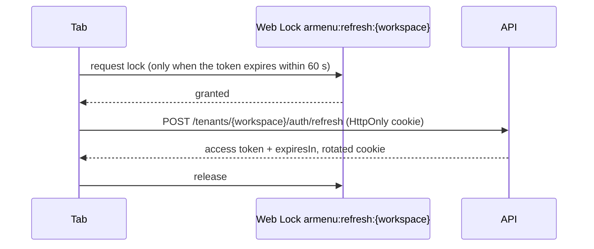

# ADR-0010: Management dashboard

- **Status:** Accepted
- **Date:** 2026-09-14

## Context

Owners, managers and staff manage a menu from a laptop at the counter or a phone in the kitchen. The dashboard must:

- keep a session secure without exposing a long-lived credential to scripts;
- make role differences obvious (staff only mark dishes sold out);
- edit every translation, reorder by drag and drop, and upload 3D models with a preview identical to what guests see;
- explain API rules (such as a price limit) next to the field they concern, in the user's language;
- be fully operable by keyboard and screen reader, including drag-and-drop ordering.

## Decision

### Stack

A second Vite app in the pnpm workspace, `web/apps/dashboard`, sharing `@armenu/api-client`, `@armenu/ar-viewer` and
`@armenu/locale` with the guest app. TanStack Router loads data in route loaders and TanStack Query owns server state.

### Session: access token in memory, refresh cookie for continuity

- The access token lives in a JavaScript field of a `Session` object, never in `localStorage` or `sessionStorage`, so
  an injected script cannot read a credential that outlives the page. A reload restores it through the refresh cookie,
  which scripts cannot read.
- Expiry is computed from `expiresIn`, so a wrong device clock cannot keep an expired token in use.
- Concurrent refreshes are single-flight within a tab and serialized across tabs with the Web Locks API, which avoids
  tripping the API's refresh-token reuse detection when several tabs wake up together.
- A `401` from any request ends the session; the shell returns to sign-in with a "session ended" notice and the
  original address as the redirect. Redirects are only accepted for same-origin paths.
- Sessions are per workspace (the cookie path is the workspace's auth endpoints), so one browser can be signed in to
  two businesses in two tabs.

### Components: React Aria Components instead of shadcn/ui

React Aria Components provide the hard parts with tested accessibility: dialogs with focus management, menus, selects,
tabs, switches, drop zones and, decisively, **keyboard and screen reader drag and drop** for `GridList`. shadcn/ui
copies Radix primitives that have no accessible drag and drop; adding dnd-kit would mean building the announcements
and keyboard model by hand. Styling stays in Tailwind with `data-*` state variants.

### Forms without a form library

Forms are uncontrolled React Aria `Form`s read with `FormData` on submit. Client validation uses native constraints;
server validation arrives as problem details with `errorCodes` per field. `formErrorsFrom` maps them to field names
(`name[tr]` becomes `name.tr`) and to messages in the interface language, and React Aria shows them on the field with
`aria-invalid` and a description. A form library would add a second source of truth for rules the API already owns.

### Editing

- Translations: one input per offered language, the default language required, `lang` and `dir` set per input.
- Drag and drop ordering for categories and items, with optimistic updates rolled back on failure.
- Sold out is an optimistic switch available to every role; the API remains the authority on roles, the UI only hides
  what a role cannot do.
- Dialogs keep ids, not entity snapshots, and read the entity from the live query, so a dialog never edits stale data
  after its own save.

### 3D models

The item dialog's 3D tab uploads through the flow in [ADR-0009](0009-direct-to-storage-asset-uploads.md), checks type
and size before a byte is sent, previews the GLB with the shared `ArViewer` (the same preset guests see, loaded on
demand), and can create the poster from the loaded model with `<model-viewer>`'s `toBlob`.

### QR codes and languages

- QR codes are encoded in the browser with `uqr` (no network request, no tracking redirect) for the menu and for each
  table (`?table=`), in a chosen language (`?lang=`), downloadable as SVG and PNG and printable as table cards.
- The languages page sets the offered languages and the default through `PUT /manage/settings/languages`, a single
  domain operation (`Tenant.SetLanguages`) so intermediate states can never violate the rules.

## Consequences

- End-to-end tests run the production build against an in-memory fake API that behaves like the real one (rotating
  HttpOnly refresh cookie, roles, problem details, presigned storage), typed by the OpenAPI contract. They cover
  sign-in, reload, sign-out, staff restrictions, keyboard reordering, server validation on a field, model upload with
  preview, QR contents and WCAG 2.2 AA checks.
- Staff invitations were deferred until the platform sent e-mail; they arrived with [ADR-0013](0013-team-invitations.md).
- The dashboard interface is Turkish and English; guests keep five languages.
- Rejected: storing the access token in `localStorage` (readable by any injected script); a BFF with server-side
  sessions (a second deployable for the same guarantee the HttpOnly refresh cookie already gives); shadcn/ui with
  dnd-kit (no accessible drag and drop out of the box); React Hook Form or TanStack Form (duplicate validation state).
