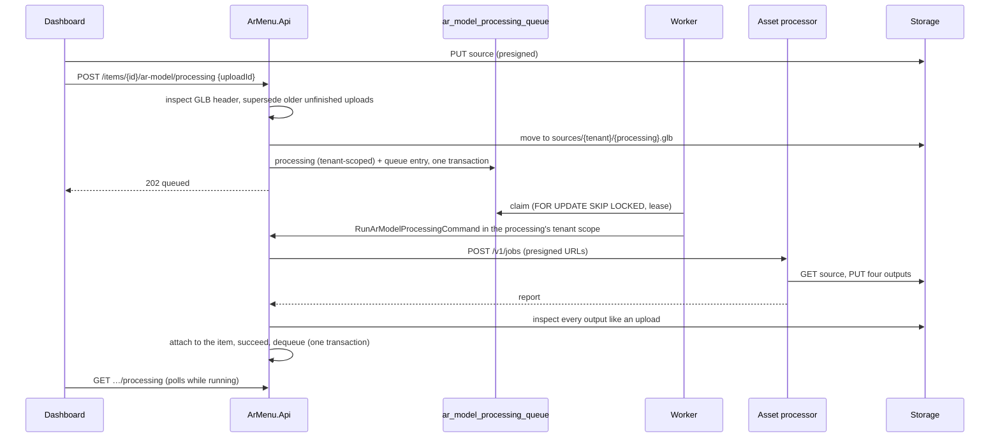

# ADR-0011: One uploaded GLB is processed into every file guests' devices need

- **Status:** Accepted
- **Date:** 2026-09-15
- **Amends:** [ADR-0009](0009-direct-to-storage-asset-uploads.md): models are no longer published as uploaded.

## Context

Until now a business uploaded up to three files per dish and published them as they were. That fails in practice:

- **Raw files are heavy.** A photogrammetry scan of a burger is easily 300,000 triangles and a 4K texture, 20 to 50 MB.
  Guests on a mobile network wait, and phones stutter turning it.
- **Three files are a lot to ask.** Few restaurants can export a USDZ and render a matching poster.
- **One file cannot serve every AR surface.** The in-page viewer and WebXR use three.js, which decodes Meshopt geometry
  and WebP textures. Android Scene Viewer opens the file itself and, according to Google's documentation, supports only
  `KHR_materials_unlit` and `KHR_texture_transform`, with PNG or JPEG textures up to 2048 px. iOS AR Quick Look needs
  USDZ.

## Decision

### Outputs

| File | Consumer | Content |
| --- | --- | --- |
| `{id}.glb` | In-page viewer, WebXR | Meshopt geometry (with quantization), WebP textures ≤ 2048 px |
| `{id}.scene-viewer.glb` | Android Scene Viewer | Float geometry, JPEG (PNG where transparent) textures ≤ 2048 px, no compression extensions |
| `{id}.usdz` | iOS AR Quick Look | Exported by `<model-viewer>` from the loaded web model, textures ≤ 1024 px |
| `{id}.webp` | Poster | The first frame of the web model in `<model-viewer>`, with the guest app's preset |

Every device downloads exactly one GLB. `ArViewer` picks the Scene Viewer file only on Android browsers without WebXR,
the case where `<model-viewer>` hands AR to Scene Viewer; everywhere else it uses the compressed file.

### Pipeline (`web/packages/model-pipeline`)

1. Read with every glTF extension, decoding Draco and Meshopt sources. Refuse KTX2 textures (nothing turns them into
   PNG or JPEG) and more than 4 million triangles.
2. Lossless cleanup: dequantize, dedup, flatten, join, weld, resample, prune.
3. Simplify to 100,000 triangles (Google's Scene Viewer recommendation) with meshoptimizer, bounded by 1% error.
4. Branch: textures to JPEG/PNG for Scene Viewer; to WebP, then Meshopt compression, for the web.
5. Load the web model into `<model-viewer>` in headless Chrome, capture the poster and export the USDZ. A model that
   does not render there is rejected (`model.render_failed`): what renders here renders on guests' phones.
6. Report source and output statistics, file sizes, the bounding box in meters, and warnings (simplified, textures
   downscaled, a size suggesting the wrong export unit, too many materials, large downloads).

The demo dishes (`web/tools/demo-assets`) go through the same pipeline.

### A processor service without storage credentials (`web/services/asset-processor`)

The pipeline needs Node.js (glTF Transform, sharp, meshoptimizer) and Chrome, so it runs as its own service with one
operation, `POST /v1/jobs`, documented by example documents in `contracts/asset-processor` that both the service's and
the API's tests check.

- The API sends **presigned URLs**: a GET for the source and a PUT per output, with the content type and immutable
  caching headers signed. The processor holds no storage credentials and can write nothing else.
- URLs must point at configured storage origins, so even a leaked token cannot turn the processor into a proxy.
- It answers `422` with a stable code for files that can never work, `502` when storage fails, and `503` at once when
  busy. It does not queue: the API's queue is the single place work waits.
- Chrome runs with every request routed from memory and anything else refused. The container image is Playwright's,
  where SwiftShader renders WebGL without a GPU.

### Jobs in the API

- **`ArModelProcessing` aggregate.** Queued → Processing → Succeeded, Failed or Superseded. It counts attempts,
  including attempts of workers that crashed, and gives up after three with `asset.processing_unavailable`. The item
  keeps its current model until processing succeeds; a newer upload supersedes an unfinished one, and a superseded
  processing that finishes anyway loses on its row version, so nothing of it is attached.
- **Queue outside row-level security, on purpose.** Workers must find jobs across tenants, which row-level security
  rightly forbids. The queue table holds only the processing id, tenant id and schedule; running a job binds the scope to
  its tenant, and everything else is read through row-level security. A guardrail test pins the queue's columns so no
  tenant data drifts into it.
- **Claims** use `FOR UPDATE SKIP LOCKED` and a lease longer than the processor timeout, so workers on any number of
  instances share the queue and a dead worker's job returns when its lease expires. Work scheduled on an instance wakes
  its workers at once; others find it within the poll interval.
- **Outputs are not trusted.** The API inspects the four files against what their consumer decodes (web GLB may require
  Meshopt and WebP; the Scene Viewer GLB may not) before attaching them.
- Keys derive from the processing id: a retry overwrites its own outputs, and published files stay immutable.

### Cleanup

An hourly job (one instance at a time, via a PostgreSQL advisory lock) deletes, per tenant and after a one-day grace
period: abandoned staging uploads, published files no item references, and sources whose model is no longer in use.
Sources of models in use are kept, so a better pipeline can reprocess them. Soft-deleted items keep their files; demo
files are outside tenant prefixes.

## Consequences

- A 47 MB Draco scan with a 4K texture became a 2.5 MB web model, a 3.6 MB Scene Viewer model, a USDZ and a poster in
  under 8 seconds in the container.
- Guests download one decoder-free file on Android without WebXR and a Meshopt file everywhere else; three.js's Meshopt
  decoder is already in the 3D chunk.
- `<model-viewer>` 4.3 enables its bundled Meshopt decoder only after loading a script from a URL; `ArViewer` gives it an
  empty in-memory script. A future content security policy must allow `blob:` scripts, or serve an empty same-origin
  file instead.
- USDZ stores geometry as text and textures as PNG, so it is the largest file. Textures are capped at 1024 px for it.
- A new service to deploy and monitor. It is stateless and scales horizontally; the API's queue decides the pace.
- Rejected: Draco for the web model (its decoder comes from a third-party CDN or adds ~300 KB); KTX2 textures (a
  transcoder on every device, and still a PNG/JPEG copy for Scene Viewer and USDZ); converting USDZ on the device (slower
  AR start on iPhones); a single compatible GLB for everyone (two to three times larger for most guests); running the
  pipeline inside the API (Node.js and Chrome in the .NET process); a message broker (PostgreSQL already provides a
  transactional queue).
